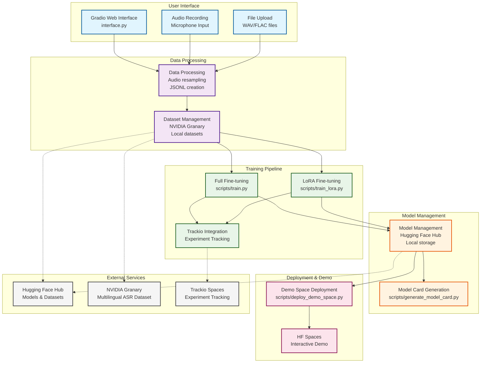

# Voxtral ASR Fine-tuning Architecture

## Architecture Overview

This diagram shows the high-level architecture of the Voxtral ASR Fine-tuning application. The system is organized into several layers:

### 1. User Interface Layer
- **Gradio Web Interface**: Main user-facing application built with Gradio
- **Audio Recording**: Microphone input for recording speech samples
- **File Upload**: Support for uploading existing WAV/FLAC audio files

### 2. Data Processing Layer
- **Data Processing**: Audio resampling to 16kHz, JSONL dataset creation
- **Dataset Management**: Integration with NVIDIA Granary dataset and local dataset handling

### 3. Training Layer
- **Full Fine-tuning**: Complete model fine-tuning using `scripts/train.py`
- **LoRA Fine-tuning**: Parameter-efficient fine-tuning using `scripts/train_lora.py`
- **Trackio Integration**: Experiment tracking and logging

### 4. Model Management Layer
- **Model Management**: Local storage and Hugging Face Hub integration
- **Model Card Generation**: Automated model card creation

### 5. Deployment Layer
- **Demo Space Deployment**: Automated deployment to Hugging Face Spaces
- **Interactive Demo**: Live demo interface for testing fine-tuned models

### 6. External Services
- **Hugging Face Hub**: Model and dataset storage and sharing
- **NVIDIA Granary**: High-quality multilingual ASR dataset
- **Trackio Spaces**: Experiment tracking and visualization

## Key Workflows

1. **Dataset Creation**: Users can record audio or upload files → processed into JSONL format
2. **Model Training**: Datasets fed into training scripts with experiment tracking
3. **Model Publishing**: Trained models pushed to HF Hub with generated model cards
4. **Demo Deployment**: Automated deployment of interactive demos to HF Spaces

See also:
- [Interface Workflow](interface-workflow.md)
- [Training Pipeline](training-pipeline.md)
- [Deployment Pipeline](deployment-pipeline.md)
- [Data Flow](data-flow.md)

