# Accessible Speech Recognition: Fine‑tune Voxtral on Your Own Voice

Building speech technology that understands everyone is an accessibility imperative. If you have a speech impediment (e.g., stutter, dysarthria, apraxia) or a heavy accent, mainstream ASR systems can struggle. This app lets you fine‑tune the Voxtral ASR model on your own voice so it adapts to your unique speaking style — improving recognition accuracy and unlocking more inclusive voice experiences.

## Who this helps

- **People with speech differences**: Personalized models that reduce error rates on your voice
- **Accented speakers**: Adapt Voxtral to your accent and vocabulary
- **Educators/clinicians**: Create tailored recognition models for communication support
- **Product teams**: Prototype inclusive voice features with real users quickly

## What you get

- **Record or upload audio** and create a JSONL dataset in a few clicks
- **One‑click training** with full fine‑tuning or LoRA for efficiency
- **Automatic publishing** to Hugging Face Hub with a generated model card
- **Instant demo deployment** to HF Spaces for shareable, live ASR

## How it works (at a glance)

```mermaid
graph TD
    %% Main Entry Point
    START([🎯 Voxtral ASR Fine-tuning App]) --> OVERVIEW{Choose Documentation}

    %% Documentation Categories
    OVERVIEW --> ARCH[🏗️ Architecture Overview]
    OVERVIEW --> WORKFLOW[🔄 Interface Workflow]
    OVERVIEW --> TRAINING[🚀 Training Pipeline]
    OVERVIEW --> DEPLOYMENT[🌐 Deployment Pipeline]
    OVERVIEW --> DATAFLOW[📊 Data Flow]

    %% Architecture Section
    ARCH --> ARCH_DIAG[High-level Architecture<br/>System Components & Layers]
    ARCH --> ARCH_LINK[📄 View Details →](architecture.md)

    %% Interface Section
    WORKFLOW --> WORKFLOW_DIAG[User Journey<br/>Recording → Training → Demo]
    WORKFLOW --> WORKFLOW_LINK[📄 View Details →](interface-workflow.md)

    %% Training Section
    TRAINING --> TRAINING_DIAG[Training Scripts<br/>Data → Model → Results]
    TRAINING --> TRAINING_LINK[📄 View Details →](training-pipeline.md)

    %% Deployment Section
    DEPLOYMENT --> DEPLOYMENT_DIAG[Publishing & Demo<br/>Model → Hub → Space]
    DEPLOYMENT --> DEPLOYMENT_LINK[📄 View Details →](deployment-pipeline.md)

    %% Data Flow Section
    DATAFLOW --> DATAFLOW_DIAG[Complete Data Journey<br/>Input → Processing → Output]
    DATAFLOW --> DATAFLOW_LINK[📄 View Details →](data-flow.md)

    %% Key Components Highlight
    subgraph "🎛️ Core Components"
        INTERFACE[interface.py<br/>Gradio Web UI]
        TRAIN_SCRIPTS[scripts/train*.py<br/>Training Scripts]
        DEPLOY_SCRIPT[scripts/deploy_demo_space.py<br/>Demo Deployment]
        PUSH_SCRIPT[scripts/push_to_huggingface.py<br/>Model Publishing]
    end

    %% Data Flow Highlight
    subgraph "📁 Key Data Formats"
        JSONL[JSONL Dataset<br/>{"audio_path": "...", "text": "..."}]
        HFDATA[HF Hub Models<br/>username/model-name]
        SPACES[HF Spaces<br/>Interactive Demos]
    end

    %% Connect components to their respective docs
    INTERFACE --> WORKFLOW
    TRAIN_SCRIPTS --> TRAINING
    DEPLOY_SCRIPT --> DEPLOYMENT
    PUSH_SCRIPT --> DEPLOYMENT

    JSONL --> DATAFLOW
    HFDATA --> DEPLOYMENT
    SPACES --> DEPLOYMENT

    %% Styling
    classDef entry fill:#e3f2fd,stroke:#1976d2,stroke-width:3px
    classDef category fill:#fff3e0,stroke:#f57c00,stroke-width:2px
    classDef diagram fill:#e8f5e8,stroke:#388e3c,stroke-width:2px
    classDef link fill:#fce4ec,stroke:#c2185b,stroke-width:2px
    classDef component fill:#f3e5f5,stroke:#7b1fa2,stroke-width:2px
    classDef data fill:#e1f5fe,stroke:#0277bd,stroke-width:2px

    class START entry
    class OVERVIEW,ARCH,WORKFLOW,TRAINING,DEPLOYMENT,DATAFLOW category
    class ARCH_DIAG,WORKFLOW_DIAG,TRAINING_DIAG,DEPLOYMENT_DIAG,DATAFLOW_DIAG diagram
    class ARCH_LINK,WORKFLOW_LINK,TRAINING_LINK,DEPLOYMENT_LINK,DATAFLOW_LINK link
    class INTERFACE,TRAIN_SCRIPTS,DEPLOY_SCRIPT,PUSH_SCRIPT component
    class JSONL,HFDATA,SPACES data
```

See the interactive diagram page for printing and quick navigation: [Interactive diagrams](diagrams.html).

## Quick start

### 1) Install

```bash
git clone https://github.com/Deep-unlearning/Finetune-Voxtral-ASR.git
cd Finetune-Voxtral-ASR
```

Use UV (recommended) or pip.

```bash
# UV
uv venv .venv --python 3.10 && source .venv/bin/activate
uv pip install -r requirements.txt

# or pip
python -m venv .venv --python 3.10 && source .venv/bin/activate
pip install --upgrade pip
pip install -r requirements.txt
```

### 2) Launch the interface

```bash
python interface.py
```

The Gradio app guides you through language selection, recording or uploading audio, dataset creation, and training.

## Create your voice dataset (UI)

```mermaid
stateDiagram-v2
    [*] --> LanguageSelection: User opens interface

    state "Language & Dataset Setup" as LangSetup {
        [*] --> LanguageSelection
        LanguageSelection --> LoadPhrases: Select language
        LoadPhrases --> DisplayPhrases: Load from NVIDIA Granary
        DisplayPhrases --> RecordingInterface: Show phrases & recording UI

        state RecordingInterface {
            [*] --> ShowInitialRows: Display first 10 phrases
            ShowInitialRows --> RecordAudio: User can record audio
            RecordAudio --> AddMoreRows: Optional - add 10 more rows
            AddMoreRows --> RecordAudio
        }
    }

    RecordingInterface --> DatasetCreation: User finishes recording

    state "Dataset Creation Options" as DatasetCreation {
        [*] --> FromRecordings: Create from recorded audio
        [*] --> FromUploads: Upload existing files

        FromRecordings --> ProcessRecordings: Save WAV files + transcripts
        FromUploads --> ProcessUploads: Process uploaded files + transcripts

        ProcessRecordings --> CreateJSONL: Generate JSONL dataset
        ProcessUploads --> CreateJSONL

        CreateJSONL --> DatasetReady: Dataset saved locally
    }

    DatasetCreation --> TrainingConfiguration: Dataset ready

    state "Training Setup" as TrainingConfiguration {
        [*] --> BasicSettings: Model, LoRA/full, batch size
        [*] --> AdvancedSettings: Learning rate, epochs, LoRA params

        BasicSettings --> ConfigureDeployment: Repo name, push options
        AdvancedSettings --> ConfigureDeployment

        ConfigureDeployment --> StartTraining: All settings configured
    }

    TrainingConfiguration --> TrainingProcess: Start training

    state "Training Process" as TrainingProcess {
        [*] --> InitializeTrackio: Setup experiment tracking
        InitializeTrackio --> RunTrainingScript: Execute train.py or train_lora.py
        RunTrainingScript --> StreamLogs: Show real-time training logs
        StreamLogs --> MonitorProgress: Track metrics & checkpoints

        MonitorProgress --> TrainingComplete: Training finished
        MonitorProgress --> HandleErrors: Training failed
        HandleErrors --> RetryOrExit: User can retry or exit
    }

    TrainingProcess --> PostTraining: Training complete

    state "Post-Training Actions" as PostTraining {
        [*] --> PushToHub: Push model to HF Hub
        [*] --> GenerateModelCard: Create model card
        [*] --> DeployDemoSpace: Deploy interactive demo

        PushToHub --> ModelPublished: Model available on HF Hub
        GenerateModelCard --> ModelDocumented: Model card created
        DeployDemoSpace --> DemoReady: Demo space deployed
    }

    PostTraining --> [*]: Process complete

    %% Alternative paths
    DatasetCreation --> PushDatasetOnly: Skip training, push dataset only
    PushDatasetOnly --> DatasetPublished: Dataset on HF Hub

    %% Error handling
    TrainingProcess --> ErrorRecovery: Handle training errors
    ErrorRecovery --> RetryTraining: Retry with different settings
    RetryTraining --> TrainingConfiguration

    %% Styling and notes
    note right of LanguageSelection : User selects language for\n        authentic phrases from\n        NVIDIA Granary dataset
    note right of RecordingInterface : Users record themselves\n        reading displayed phrases
    note right of DatasetCreation : JSONL format: {"audio_path": "...", "text": "..."}
    note right of TrainingConfiguration : Configure LoRA parameters,\n        learning rate, epochs, etc.
    note right of TrainingProcess : Real-time log streaming\n        with Trackio integration
    note right of PostTraining : Automated deployment\n        pipeline
```

Steps you’ll follow in the UI:

- **Choose language**: Select a language for authentic phrases (from NVIDIA Granary)
- **Record or upload**: Capture your voice or provide existing audio + transcripts
- **Create dataset**: The app writes a JSONL file with entries like `{ "audio_path": ..., "text": ... }`
- **Configure training**: Pick base model, LoRA vs full, batch size and learning rate
- **Run training**: Watch live logs and metrics; resume on error if needed
- **Publish & deploy**: Push to HF Hub and one‑click deploy an interactive Space

## Train your personalized Voxtral model

Under the hood, training uses Hugging Face Trainer and a custom `VoxtralDataCollator` that builds Voxtral/LLaMA‑style prompts and masks the prompt tokens so loss is computed only on the transcription.

```mermaid
graph TB
    %% Input Data Sources
    subgraph "Data Sources"
        JSONL[JSONL Dataset<br/>{"audio_path": "...", "text": "..."}]
        GRANARY[NVIDIA Granary Dataset<br/>Multilingual ASR Data]
        HFDATA[HF Hub Datasets<br/>Community Datasets]
    end

    %% Data Processing
    subgraph "Data Processing"
        LOADER[Dataset Loader<br/>_load_jsonl_dataset()]
        CASTER[Audio Casting<br/>16kHz resampling]
        COLLATOR[VoxtralDataCollator<br/>Audio + Text Processing]
    end

    %% Training Scripts
    subgraph "Training Scripts"
        TRAIN_FULL[Full Fine-tuning<br/>scripts/train.py]
        TRAIN_LORA[LoRA Fine-tuning<br/>scripts/train_lora.py]

        subgraph "Training Components"
            MODEL_INIT[Model Initialization<br/>VoxtralForConditionalGeneration]
            LORA_CONFIG[LoRA Configuration<br/>LoraConfig + get_peft_model]
            PROCESSOR_INIT[Processor Initialization<br/>VoxtralProcessor]
        end
    end

    %% Training Infrastructure
    subgraph "Training Infrastructure"
        TRACKIO_INIT[Trackio Integration<br/>Experiment Tracking]
        HF_TRAINER[Hugging Face Trainer<br/>TrainingArguments + Trainer]
        TORCH_DEVICE[Torch Device Setup<br/>GPU/CPU Detection]
    end

    %% Training Process
    subgraph "Training Process"
        FORWARD_PASS[Forward Pass<br/>Audio Processing + Generation]
        LOSS_CALC[Loss Calculation<br/>Masked Language Modeling]
        BACKWARD_PASS[Backward Pass<br/>Gradient Computation]
        OPTIMIZER_STEP[Optimizer Step<br/>Parameter Updates]
        LOGGING[Metrics Logging<br/>Loss, Perplexity, etc.]
    end

    %% Model Management
    subgraph "Model Management"
        CHECKPOINT_SAVING[Checkpoint Saving<br/>Model snapshots]
        MODEL_SAVING[Final Model Saving<br/>Processor + Model]
        LOCAL_STORAGE[Local Storage<br/>outputs/ directory]
    end

    %% Flow Connections
    JSONL --> LOADER
    GRANARY --> LOADER
    HFDATA --> LOADER

    LOADER --> CASTER
    CASTER --> COLLATOR

    COLLATOR --> TRAIN_FULL
    COLLATOR --> TRAIN_LORA

    TRAIN_FULL --> MODEL_INIT
    TRAIN_LORA --> MODEL_INIT
    TRAIN_LORA --> LORA_CONFIG

    MODEL_INIT --> PROCESSOR_INIT
    LORA_CONFIG --> PROCESSOR_INIT

    PROCESSOR_INIT --> TRACKIO_INIT
    PROCESSOR_INIT --> HF_TRAINER
    PROCESSOR_INIT --> TORCH_DEVICE

    TRACKIO_INIT --> HF_TRAINER
    TORCH_DEVICE --> HF_TRAINER

    HF_TRAINER --> FORWARD_PASS
    FORWARD_PASS --> LOSS_CALC
    LOSS_CALC --> BACKWARD_PASS
    BACKWARD_PASS --> OPTIMIZER_STEP
    OPTIMIZER_STEP --> LOGGING

    LOGGING --> CHECKPOINT_SAVING
    LOGGING --> TRACKIO_INIT

    HF_TRAINER --> MODEL_SAVING
    MODEL_SAVING --> LOCAL_STORAGE

    %% Styling
    classDef input fill:#e3f2fd,stroke:#1976d2,stroke-width:2px
    classDef processing fill:#f3e5f5,stroke:#7b1fa2,stroke-width:2px
    classDef training fill:#e8f5e8,stroke:#388e3c,stroke-width:2px
    classDef infrastructure fill:#fff3e0,stroke:#f57c00,stroke-width:2px
    classDef execution fill:#fce4ec,stroke:#c2185b,stroke-width:2px
    classDef output fill:#f5f5f5,stroke:#424242,stroke-width:2px

    class JSONL,GRANARY,HFDATA input
    class LOADER,CASTER,COLLATOR processing
    class TRAIN_FULL,TRAIN_LORA,MODEL_INIT,LORA_CONFIG,PROCESSOR_INIT training
    class TRACKIO_INIT,HF_TRAINER,TORCH_DEVICE infrastructure
    class FORWARD_PASS,LOSS_CALC,BACKWARD_PASS,OPTIMIZER_STEP,LOGGING execution
    class CHECKPOINT_SAVING,MODEL_SAVING,LOCAL_STORAGE output
```

CLI alternatives (if you prefer the terminal):

```bash
# Full fine-tuning
uv run train.py

# Parameter‑efficient LoRA fine‑tuning (recommended for most users)
uv run train_lora.py
```

## Publish and deploy a live demo

After training, the app can push your model and metrics to the Hugging Face Hub and create an interactive Space demo automatically.

```mermaid
graph TB
    %% Input Sources
    subgraph "Inputs"
        TRAINED_MODEL[Trained Model<br/>Local directory]
        TRAINING_CONFIG[Training Config<br/>JSON/YAML]
        TRAINING_RESULTS[Training Results<br/>Metrics & logs]
        MODEL_METADATA[Model Metadata<br/>Name, description, etc.]
    end

    %% Model Publishing
    subgraph "Model Publishing"
        PUSH_SCRIPT[push_to_huggingface.py<br/>Model Publisher]

        subgraph "Publishing Steps"
            REPO_CREATION[Repository Creation<br/>HF Hub API]
            FILE_UPLOAD[File Upload<br/>Model files to HF]
            METADATA_UPLOAD[Metadata Upload<br/>Config & results]
        end
    end

    %% Model Card Generation
    subgraph "Model Card Generation"
        CARD_SCRIPT[generate_model_card.py<br/>Card Generator]

        subgraph "Card Components"
            TEMPLATE_LOAD[Template Loading<br/>model_card.md]
            VARIABLE_REPLACEMENT[Variable Replacement<br/>Config injection]
            CONDITIONAL_PROCESSING[Conditional Sections<br/>Quantized models, etc.]
        end
    end

    %% Demo Space Deployment
    subgraph "Demo Space Deployment"
        DEPLOY_SCRIPT[deploy_demo_space.py<br/>Space Deployer]

        subgraph "Space Setup"
            SPACE_CREATION[Space Repository<br/>Create HF Space]
            TEMPLATE_COPY[Template Copying<br/>demo_voxtral/ files]
            ENV_INJECTION[Environment Setup<br/>Model config injection]
            SECRET_SETUP[Secret Configuration<br/>HF_TOKEN, model vars]
        end
    end

    %% Space Building & Testing
    subgraph "Space Building"
        BUILD_TRIGGER[Build Trigger<br/>Automatic build start]
        DEPENDENCY_INSTALL[Dependency Installation<br/>requirements.txt]
        MODEL_DOWNLOAD[Model Download<br/>From HF Hub]
        APP_INITIALIZATION[App Initialization<br/>Gradio app setup]
    end

    %% Live Demo
    subgraph "Live Demo Space"
        GRADIO_INTERFACE[Gradio Interface<br/>Interactive demo]
        MODEL_INFERENCE[Model Inference<br/>Real-time ASR]
        USER_INTERACTION[User Interaction<br/>Audio upload/playback]
    end

    %% External Services
    subgraph "External Services"
        HF_HUB[Hugging Face Hub<br/>Model & Space hosting]
        HF_SPACES[HF Spaces Platform<br/>Demo hosting]
    end

    %% Flow Connections
    TRAINED_MODEL --> PUSH_SCRIPT
    TRAINING_CONFIG --> PUSH_SCRIPT
    TRAINING_RESULTS --> PUSH_SCRIPT
    MODEL_METADATA --> PUSH_SCRIPT

    PUSH_SCRIPT --> REPO_CREATION
    REPO_CREATION --> FILE_UPLOAD
    FILE_UPLOAD --> METADATA_UPLOAD

    METADATA_UPLOAD --> CARD_SCRIPT
    TRAINING_CONFIG --> CARD_SCRIPT
    TRAINING_RESULTS --> CARD_SCRIPT

    CARD_SCRIPT --> TEMPLATE_LOAD
    TEMPLATE_LOAD --> VARIABLE_REPLACEMENT
    VARIABLE_REPLACEMENT --> CONDITIONAL_PROCESSING

    CONDITIONAL_PROCESSING --> DEPLOY_SCRIPT
    METADATA_UPLOAD --> DEPLOY_SCRIPT

    DEPLOY_SCRIPT --> SPACE_CREATION
    SPACE_CREATION --> TEMPLATE_COPY
    TEMPLATE_COPY --> ENV_INJECTION
    ENV_INJECTION --> SECRET_SETUP

    SECRET_SETUP --> BUILD_TRIGGER
    BUILD_TRIGGER --> DEPENDENCY_INSTALL
    DEPENDENCY_INSTALL --> MODEL_DOWNLOAD
    MODEL_DOWNLOAD --> APP_INITIALIZATION

    APP_INITIALIZATION --> GRADIO_INTERFACE
    GRADIO_INTERFACE --> MODEL_INFERENCE
    MODEL_INFERENCE --> USER_INTERACTION

    HF_HUB --> MODEL_DOWNLOAD
    HF_SPACES --> GRADIO_INTERFACE

    %% Styling
    classDef input fill:#e3f2fd,stroke:#1976d2,stroke-width:2px
    classDef publishing fill:#e8f5e8,stroke:#388e3c,stroke-width:2px
    classDef generation fill:#fff3e0,stroke:#f57c00,stroke-width:2px
    classDef deployment fill:#fce4ec,stroke:#c2185b,stroke-width:2px
    classDef building fill:#f3e5f5,stroke:#7b1fa2,stroke-width:2px
    classDef demo fill:#e1f5fe,stroke:#0277bd,stroke-width:2px
    classDef external fill:#f5f5f5,stroke:#424242,stroke-width:2px

    class TRAINED_MODEL,TRAINING_CONFIG,TRAINING_RESULTS,MODEL_METADATA input
    class PUSH_SCRIPT,REPO_CREATION,FILE_UPLOAD,METADATA_UPLOAD publishing
    class CARD_SCRIPT,TEMPLATE_LOAD,VARIABLE_REPLACEMENT,CONDITIONAL_PROCESSING generation
    class DEPLOY_SCRIPT,SPACE_CREATION,TEMPLATE_COPY,ENV_INJECTION,SECRET_SETUP deployment
    class BUILD_TRIGGER,DEPENDENCY_INSTALL,MODEL_DOWNLOAD,APP_INITIALIZATION building
    class GRADIO_INTERFACE,MODEL_INFERENCE,USER_INTERACTION demo
    class HF_HUB,HF_SPACES external
```



## Why personalization improves accessibility

- **Your model learns your patterns**: tempo, prosody, phoneme realizations, disfluencies
- **Vocabulary and names**: teach domain terms and proper nouns you use often
- **Bias correction**: reduce systematic errors common to off‑the‑shelf ASR for your voice
- **Agency and privacy**: keep data local and only publish when you choose

## Practical tips

- **Start with LoRA**: Parameter‑efficient fine‑tuning is faster and uses less memory
- **Record diverse samples**: Different tempos, environments, and phrase lengths
- **Short sessions**: Many shorter clips beat a few long ones for learning
- **Check transcripts**: Clean, accurate transcripts improve outcomes

## Learn more

- [Repository README](../README.md)
- [Documentation Overview](README.md)
- [Architecture Overview](architecture.md)
- [Interface Workflow](interface-workflow.md)
- [Training Pipeline](training-pipeline.md)
- [Deployment Pipeline](deployment-pipeline.md)
- [Data Flow](data-flow.md)
- [Interactive Diagrams](diagrams.html)

---

This project exists to make voice technology work better for everyone. If you build a model that helps you — or your community — consider sharing a demo so others can learn from it.
