# Deployment Pipeline

```mermaid
graph TB
    %% Input Sources
    subgraph "Inputs"
        TRAINED_MODEL[Trained Model<br/>Local directory]
        TRAINING_CONFIG[Training Config<br/>JSON/YAML]
        TRAINING_RESULTS[Training Results<br/>Metrics & logs]
        MODEL_METADATA[Model Metadata<br/>Name, description, etc.]
    end

    %% Model Publishing
    subgraph "Model Publishing"
        PUSH_SCRIPT[push_to_huggingface.py<br/>Model Publisher]

        subgraph "Publishing Steps"
            REPO_CREATION[Repository Creation<br/>HF Hub API]
            FILE_UPLOAD[File Upload<br/>Model files to HF]
            METADATA_UPLOAD[Metadata Upload<br/>Config & results]
        end
    end

    %% Model Card Generation
    subgraph "Model Card Generation"
        CARD_SCRIPT[generate_model_card.py<br/>Card Generator]

        subgraph "Card Components"
            TEMPLATE_LOAD[Template Loading<br/>model_card.md]
            VARIABLE_REPLACEMENT[Variable Replacement<br/>Config injection]
            CONDITIONAL_PROCESSING[Conditional Sections<br/>Quantized models, etc.]
        end
    end

    %% Demo Space Deployment
    subgraph "Demo Space Deployment"
        DEPLOY_SCRIPT[deploy_demo_space.py<br/>Space Deployer]

        subgraph "Space Setup"
            SPACE_CREATION[Space Repository<br/>Create HF Space]
            TEMPLATE_COPY[Template Copying<br/>demo_voxtral/ files]
            ENV_INJECTION[Environment Setup<br/>Model config injection]
            SECRET_SETUP[Secret Configuration<br/>HF_TOKEN, model vars]
        end
    end

    %% Space Building & Testing
    subgraph "Space Building"
        BUILD_TRIGGER[Build Trigger<br/>Automatic build start]
        DEPENDENCY_INSTALL[Dependency Installation<br/>requirements.txt]
        MODEL_DOWNLOAD[Model Download<br/>From HF Hub]
        APP_INITIALIZATION[App Initialization<br/>Gradio app setup]
    end

    %% Live Demo
    subgraph "Live Demo Space"
        GRADIO_INTERFACE[Gradio Interface<br/>Interactive demo]
        MODEL_INFERENCE[Model Inference<br/>Real-time ASR]
        USER_INTERACTION[User Interaction<br/>Audio upload/playback]
    end

    %% External Services
    subgraph "External Services"
        HF_HUB[Hugging Face Hub<br/>Model & Space hosting]
        HF_SPACES[HF Spaces Platform<br/>Demo hosting]
    end

    %% Flow Connections
    TRAINED_MODEL --> PUSH_SCRIPT
    TRAINING_CONFIG --> PUSH_SCRIPT
    TRAINING_RESULTS --> PUSH_SCRIPT
    MODEL_METADATA --> PUSH_SCRIPT

    PUSH_SCRIPT --> REPO_CREATION
    REPO_CREATION --> FILE_UPLOAD
    FILE_UPLOAD --> METADATA_UPLOAD

    METADATA_UPLOAD --> CARD_SCRIPT
    TRAINING_CONFIG --> CARD_SCRIPT
    TRAINING_RESULTS --> CARD_SCRIPT

    CARD_SCRIPT --> TEMPLATE_LOAD
    TEMPLATE_LOAD --> VARIABLE_REPLACEMENT
    VARIABLE_REPLACEMENT --> CONDITIONAL_PROCESSING

    CONDITIONAL_PROCESSING --> DEPLOY_SCRIPT
    METADATA_UPLOAD --> DEPLOY_SCRIPT

    DEPLOY_SCRIPT --> SPACE_CREATION
    SPACE_CREATION --> TEMPLATE_COPY
    TEMPLATE_COPY --> ENV_INJECTION
    ENV_INJECTION --> SECRET_SETUP

    SECRET_SETUP --> BUILD_TRIGGER
    BUILD_TRIGGER --> DEPENDENCY_INSTALL
    DEPENDENCY_INSTALL --> MODEL_DOWNLOAD
    MODEL_DOWNLOAD --> APP_INITIALIZATION

    APP_INITIALIZATION --> GRADIO_INTERFACE
    GRADIO_INTERFACE --> MODEL_INFERENCE
    MODEL_INFERENCE --> USER_INTERACTION

    HF_HUB --> MODEL_DOWNLOAD
    HF_SPACES --> GRADIO_INTERFACE

    %% Styling
    classDef input fill:#e3f2fd,stroke:#1976d2,stroke-width:2px
    classDef publishing fill:#e8f5e8,stroke:#388e3c,stroke-width:2px
    classDef generation fill:#fff3e0,stroke:#f57c00,stroke-width:2px
    classDef deployment fill:#fce4ec,stroke:#c2185b,stroke-width:2px
    classDef building fill:#f3e5f5,stroke:#7b1fa2,stroke-width:2px
    classDef demo fill:#e1f5fe,stroke:#0277bd,stroke-width:2px
    classDef external fill:#f5f5f5,stroke:#424242,stroke-width:2px

    class TRAINED_MODEL,TRAINING_CONFIG,TRAINING_RESULTS,MODEL_METADATA input
    class PUSH_SCRIPT,REPO_CREATION,FILE_UPLOAD,METADATA_UPLOAD publishing
    class CARD_SCRIPT,TEMPLATE_LOAD,VARIABLE_REPLACEMENT,CONDITIONAL_PROCESSING generation
    class DEPLOY_SCRIPT,SPACE_CREATION,TEMPLATE_COPY,ENV_INJECTION,SECRET_SETUP deployment
    class BUILD_TRIGGER,DEPENDENCY_INSTALL,MODEL_DOWNLOAD,APP_INITIALIZATION building
    class GRADIO_INTERFACE,MODEL_INFERENCE,USER_INTERACTION demo
    class HF_HUB,HF_SPACES external
```



## Deployment Pipeline Overview

This diagram illustrates the complete deployment pipeline that takes a trained Voxtral model and makes it available as an interactive demo on Hugging Face Spaces.

### Input Sources

#### Trained Model Artifacts
- **Model Files**: `model.safetensors`, `config.json`, `tokenizer.json`
- **Training Config**: Hyperparameters and training setup
- **Training Results**: Metrics, loss curves, evaluation results
- **Model Metadata**: Name, description, base model information

### Model Publishing Phase

#### push_to_huggingface.py Script
```python
# Initialize publisher
pusher = HuggingFacePusher(
    model_path=output_dir,
    repo_name=repo_name,
    token=hf_token
)

# Push model
success = pusher.push_model(training_config, results)
```

#### Publishing Steps
1. **Repository Creation**: Create HF Hub repository
2. **File Upload**: Upload all model files
3. **Metadata Upload**: Upload training config and results

### Model Card Generation

#### generate_model_card.py Script
```python
# Create generator
generator = ModelCardGenerator()

# Generate card
variables = {
    "model_name": model_name,
    "repo_name": repo_id,
    "base_model": base_model,
    # ... other variables
}
content = generator.generate_model_card(variables)
```

#### Card Processing
1. **Template Loading**: Load from `templates/model_card.md`
2. **Variable Replacement**: Inject actual values
3. **Conditional Processing**: Handle optional sections

### Demo Space Deployment

#### deploy_demo_space.py Script
```python
# Initialize deployer
deployer = DemoSpaceDeployer(
    hf_token=token,
    hf_username=username,
    model_id=model_id,
    demo_type="voxtral"
)

# Deploy space
success = deployer.deploy()
```

#### Space Setup Process
1. **Space Creation**: Create HF Space repository
2. **Template Copying**: Copy demo template files
3. **Environment Injection**: Set model-specific variables
4. **Secret Configuration**: Configure HF_TOKEN and model variables

### Space Building Process

#### Automatic Build Trigger
- **Dependency Installation**: `pip install -r requirements.txt`
- **Model Download**: Download model from HF Hub
- **App Initialization**: Setup Gradio application

#### Demo Template Structure
```
templates/spaces/demo_voxtral/
├── app.py              # Main Gradio application
├── requirements.txt    # Python dependencies
└── README.md          # Space documentation
```

### Live Demo Features

#### Gradio Interface
- **Audio Upload**: File upload or recording
- **Real-time Inference**: Live ASR transcription
- **Interactive Controls**: Model parameters, settings

#### Model Inference Pipeline
- **Audio Processing**: Convert to model inputs
- **Transcription Generation**: Run ASR inference
- **Result Display**: Show transcription with confidence

### Configuration Management

#### Environment Variables
```python
# Set in Space secrets/environment
os.environ['HF_MODEL_ID'] = model_id
os.environ['MODEL_NAME'] = model_name
os.environ['HF_TOKEN'] = token  # For model access
```

#### Demo-Specific Settings
- **Model Configuration**: Base model, subfolder, quantization
- **UI Branding**: Custom titles, descriptions, links
- **Example Prompts**: Pre-configured demo examples

### Error Handling & Monitoring

#### Build Process Monitoring
- **Build Logs**: Real-time build status
- **Error Detection**: Failed dependency installation
- **Retry Logic**: Automatic rebuild on failure

#### Runtime Monitoring
- **Space Health**: Uptime and responsiveness
- **Model Loading**: Successful model initialization
- **Inference Errors**: Runtime error handling

### Security Considerations

#### Token Management
- **Read-Only Tokens**: Use read-only tokens for demo spaces
- **Secret Storage**: Secure storage of HF_TOKEN
- **Access Control**: Proper repository permissions

#### Resource Management
- **Memory Limits**: Space hardware constraints
- **Timeout Handling**: Inference timeout protection
- **Rate Limiting**: Prevent abuse

### Integration Points

#### With Training Scripts
- **Training Config**: Used for model card generation
- **Training Results**: Included in model metadata
- **Model Path**: Direct path to trained model files

#### With Interface (interface.py)
- **Parameter Passing**: Deployment settings from UI
- **Progress Updates**: Deployment progress to user
- **Result Links**: Direct links to deployed spaces

### Deployment Workflows

#### Full Pipeline (Recommended)
1. Train model → Generate model card → Push to Hub → Deploy demo
2. All steps automated through single interface action
3. Comprehensive error handling and rollback

#### Manual Deployment
1. Use individual scripts for granular control
2. Custom configuration and branding
3. Debugging and troubleshooting capabilities

#### CI/CD Integration
- **Automated Triggers**: GitHub Actions integration
- **Version Control**: Model versioning and releases
- **Testing**: Automated demo testing

### Performance Optimization

#### Space Hardware Selection
- **CPU Basic**: Free tier, sufficient for small models
- **GPU Options**: For larger models requiring acceleration
- **Memory Scaling**: Based on model size requirements

#### Model Optimization
- **Quantization**: 4-bit quantization for smaller footprint
- **Model Sharding**: Split large models across memory
- **Caching**: Model caching for faster cold starts

### Monitoring & Analytics

#### Space Analytics
- **Usage Metrics**: Daily active users, session duration
- **Performance Metrics**: Inference latency, error rates
- **User Feedback**: Demo effectiveness and issues

#### Model Analytics
- **Download Stats**: Model popularity and usage
- **Citation Tracking**: Academic and research usage
- **Community Feedback**: GitHub issues and discussions

See also:
- [Architecture Overview](architecture.md)
- [Training Pipeline](training-pipeline.md)
- [Data Flow](data-flow.md)

